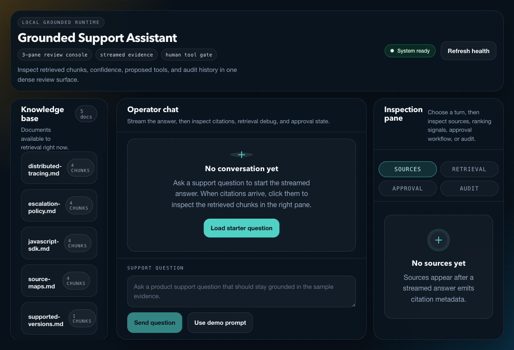
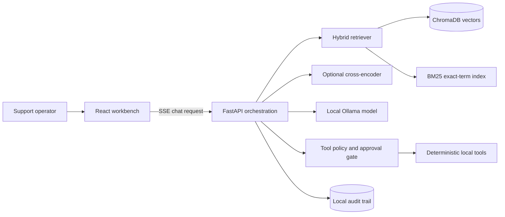

# Grounded Support Assistant

[](https://github.com/anujraja/grounded-support-assistant/actions/workflows/ci.yml)


[](LICENSE)

A local-first technical-support workbench that combines hybrid retrieval, cited RAG answers, human-approved tools, and explicit escalation when the evidence is weak.

This is a compact engineering demonstration, not a production support system. The included support documents are fictional and are not official Sentry documentation.



## Why this project

Many RAG demos stop at a chat box. This project makes the parts that matter in support engineering inspectable:

- semantic retrieval and BM25 exact-term retrieval are scored separately and fused;
- every citation maps to a retrieved chunk owned by the server;
- confidence is presented as an explainable heuristic, not false certainty;
- the model may propose a tool but cannot execute one;
- destructive and unknown actions are rejected before execution;
- low-confidence cases recommend a human support engineer;
- retrieval, approval, confidence, and escalation decisions appear in an audit trail.

## Evidence at a glance

The checked-in evaluation is intentionally small and fictional, but it is rerunnable and records its own machine, model, corpus, and run-mode caveats. See the [full public report](docs/evaluation-report.md) for the exact source data.

| Evidence | Latest checked-in local result | Scope |
| --- | --- | --- |
| Hybrid retrieval | Semantic, BM25, and fused Hit@1/Hit@3: **1.000** | 5 labelled cases, 17-chunk fictional corpus |
| Citation boundary | **10/10** controlled checks; 0 unsupported labels rendered | Server-owned numeric-label allowlisting, not claim entailment |
| Tool policy + escalation | **3/3** expected outcomes | Denied execution, destructive refusal, and low-confidence escalation |
| Local response timing | Median first token **309.473 ms**; completion **2529.735 ms** | 3 warm FastAPI/Ollama SSE samples; reranking disabled |

These figures are not production, clean-start, hosted-model, or user-traffic benchmarks. The [truth handoff](docs/evaluation-truth.md) lists the exact resume-safe facts and the qualifiers that must travel with them.

## Architecture at a glance



Detailed diagrams and runtime sequences are in [Architecture](docs/architecture.md). The main request path is:

```text
Question
  -> vector retrieval + BM25 retrieval
  -> score normalization, fusion, and deduplication
  -> optional reranking
  -> confidence heuristic and context construction
  -> Ollama generation with server-validated citations
  -> optional tool proposal
  -> explicit human approval or rejection
  -> deterministic execution, audit record, or escalation
```

## Run the demo

Prerequisites: [Miniforge or Conda](https://github.com/conda-forge/miniforge), [Ollama](https://ollama.com/), and approximately 3 GB of free space for local models and dependencies.

```bash
git clone https://github.com/anujraja/grounded-support-assistant.git
cd grounded-support-assistant
cp .env.example .env
conda env create -f environment.yml
conda run -n grounded-support-assistant npm --prefix frontend ci
ollama pull qwen2.5:3b
./run-demo.sh
```

Open [http://localhost:5173](http://localhost:5173). The API runs at [http://localhost:8010](http://localhost:8010), with interactive OpenAPI documentation at [http://localhost:8010/docs](http://localhost:8010/docs).

`run-demo.sh` checks the configured local Ollama URL, starts `ollama serve` when necessary, and launches both application processes. The first ingestion downloads the local embedding model and can take longer than subsequent starts.

## Three-minute interview walkthrough

1. Ask **“What does the `sentry-trace` header do?”** and show streaming, citations, and source excerpts.
2. Open **Retrieval** and compare vector, BM25, fused scores, and final ranks.
3. Ask **“Is JavaScript SDK version 99.0 supported?”** and inspect the proposed deterministic version-check tool.
4. Approve the proposal, show the result, and confirm the approval is recorded in **Audit**.
5. Ask an out-of-corpus question and show the low-confidence escalation warning.
6. Ask to delete a production project and show that no destructive tool can be proposed.

The full operator script and fallback plan are in [Demo guide](docs/demo-guide.md).

## Technical design

| Concern | Implementation |
| --- | --- |
| Ingestion | Heading-aware overlapping chunks, content hashes, duplicate rejection |
| Semantic search | Sentence Transformers embeddings stored in ChromaDB |
| Exact-term search | `rank-bm25` for headers, versions, error codes, and configuration keys |
| Fusion | Independently normalized scores, 55/45 vector-to-BM25 weighting, chunk-ID deduplication |
| Reranking | Optional local cross-encoder with graceful fallback |
| Generation | Ollama HTTP streaming through FastAPI server-sent events |
| Citations | Server-owned citation labels; unsupported model labels are removed |
| Confidence | Retrieval strength, vector/BM25 agreement, support count, and out-of-corpus signals |
| Tools | Three strict Pydantic schemas, persisted proposal IDs, single-use approval decisions |
| Safety | No network, filesystem, production, or destructive tool capability |
| Audit | Local redacted records for questions, sources, tool decisions, confidence, and escalation |

## Documentation

- [Architecture](docs/architecture.md): context, containers, components, sequences, and failure modes
- [Design decisions](docs/design-decisions.md): compact architecture decision records and tradeoffs
- [Security model](docs/security.md): trust boundaries, threats, mitigations, and POC gaps
- [Evaluation strategy](docs/evaluation.md): methodology and scope for the reproducible evaluation harness
- [Public evaluation report](docs/evaluation-report.md): current local measurements, caveats, failures, and rerun commands
- [Machine-readable evaluation results](docs/evaluation-results.json): corpus/model/configuration metadata beside every measurement
- [Evaluation truth handoff](docs/evaluation-truth.md): verified, resume-safe statements and qualifiers
- [API and streaming contract](docs/api.md): endpoints, SSE events, and approval lifecycle
- [Engineering case study](docs/case-study.md): problem framing, constraints, implementation, and next steps
- [Demo guide](docs/demo-guide.md): the interview runbook and troubleshooting path

The documentation separates quickstart, operational guidance, reference, and design explanation so the README stays useful as the repository entry point.

## Configuration

| Variable | Default | Purpose |
| --- | --- | --- |
| `OLLAMA_BASE_URL` | `http://localhost:11434` | Ollama HTTP endpoint |
| `OLLAMA_MODEL` | `qwen2.5:3b` | Local generation model |
| `CHROMA_PATH` | `./data/chroma` | Persistent vector-store directory |
| `EMBEDDING_MODEL` | `all-MiniLM-L6-v2` | Sentence Transformer model |
| `ENABLE_RERANKING` | `false` | Enable optional cross-encoder reranking |
| `RERANKER_MODEL` | `cross-encoder/ms-marco-MiniLM-L-6-v2` | Local reranker model |
| `TOP_K` | `6` | Maximum retrieved chunks supplied to generation |

## Tests and CI

```bash
conda run -n grounded-support-assistant pytest -q backend/tests
conda run -n grounded-support-assistant npm --prefix frontend run build
docker compose config --quiet
```

The test suite covers chunking, duplicate ingestion, exact BM25 terms, score fusion, citation integrity, strict tool schemas, explicit approval, low-confidence escalation, and destructive-request refusal. GitHub Actions runs backend tests and the frontend production build independently.

## Reproduce the evaluation

The version-controlled fictional evaluation set lives in [`backend/evaluation/cases.json`](backend/evaluation/cases.json). It evaluates semantic, BM25, and fused retrieval ranking; the server citation-label boundary; deterministic tool approval policy; and low-confidence escalation.

```bash
conda run -n grounded-support-assistant python backend/scripts/run_evaluation.py
```

With the local API and Ollama running, record a warm-process end-to-end HTTP/SSE sample too:

```bash
conda run -n grounded-support-assistant python backend/scripts/run_evaluation.py --api-url http://127.0.0.1:8010
```

Do not compare the local figures with hosted models: this repository implements only local Ollama generation and does not fabricate hosted measurements.

## Safety boundaries and limitations

- Tool proposals, approvals, and audit events are process-local demonstration state.
- There is no authentication, tenant isolation, rate limiting, or durable audit storage.
- Confidence is a transparent heuristic, not a calibrated probability.
- Citation validation constrains labels, but it is not a full claim-level entailment checker.
- Answer quality depends on the local model and the deliberately small fictional corpus.
- Optional reranking downloads an additional model and increases first-request latency.

Production hardening would add identity and authorization, durable append-only audit storage, evaluation datasets, calibrated uncertainty, observability, tenant isolation, abuse controls, and staged tool execution.

## Author

Built by [Anuj Raja](https://github.com/anujraja) as a portfolio demonstration of retrieval engineering, local AI integration, safety boundaries, and full-stack product delivery.

Released under the [MIT License](LICENSE).
