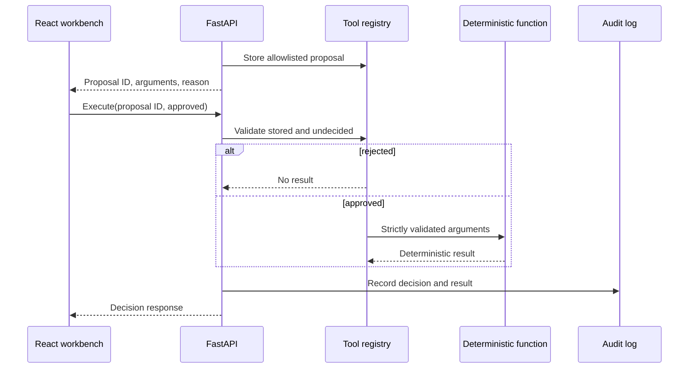

# API and streaming contract

The FastAPI service owns retrieval, citation numbering, confidence, tool policy, and audit state. The browser is a renderer and approval surface; it does not create evidence or execute tools directly.

## Endpoints

| Method | Path | Purpose |
| --- | --- | --- |
| `GET` | `/health` | Report Chroma, Ollama model, and reranker status |
| `POST` | `/api/ingest` | Ingest the bundled fictional documents |
| `POST` | `/api/upload` | Ingest one UTF-8 `.md` or `.txt` file up to 2 MB |
| `POST` | `/api/chat` | Retrieve evidence and stream a cited answer using SSE |
| `POST` | `/api/tools/propose` | Create an allowlisted proposal from a question and findings |
| `POST` | `/api/tools/execute` | Approve or reject a stored, undecided proposal |
| `GET` | `/api/documents` | List indexed files and chunk counts |
| `GET` | `/api/audit` | Return the local redacted audit trail |

Interactive request and response schemas are available at `/docs` while the backend is running.

## Chat request

```json
{
  "question": "What does the sentry-trace header do?",
  "rerank": null
}
```

`rerank` may be `true`, `false`, or omitted. When omitted, the environment setting controls the optional reranker.

## Server-sent events

`POST /api/chat` returns `text/event-stream`. Events arrive in this order:

1. `meta`: citations, retrieved chunks, score details, confidence, tool proposal, audit ID, and safety flags.
2. `token`: one or more incremental text fragments from Ollama or a deterministic refusal.
3. `error`: a safe error description when retrieval or generation fails.
4. `done`: the terminal event, normally carrying the audit ID.

Example framing:

```text
event: meta
data: {"citations":[...],"confidence":{...}}

event: token
data: "Verified finding... [1]"

event: done
data: {"audit_id":"..."}
```

The server accepts only citation numbers that correspond to the retrieved chunk list. Unsupported numeric labels emitted by the model are replaced, and a grounded response with evidence receives at least one supporting citation.

## Tool lifecycle



A proposal can be decided once. Unknown proposal IDs, repeated decisions, unknown tool names, and unexpected arguments are rejected.

## Error behavior

- Unsupported upload type: `415`
- Upload larger than 2 MB: `413`
- Non-UTF-8 upload: `400`
- Invalid Pydantic request: `422`
- Invalid or already-decided tool proposal: `400`
- Ollama/retrieval failure during chat: streamed `error`, followed by `done`
