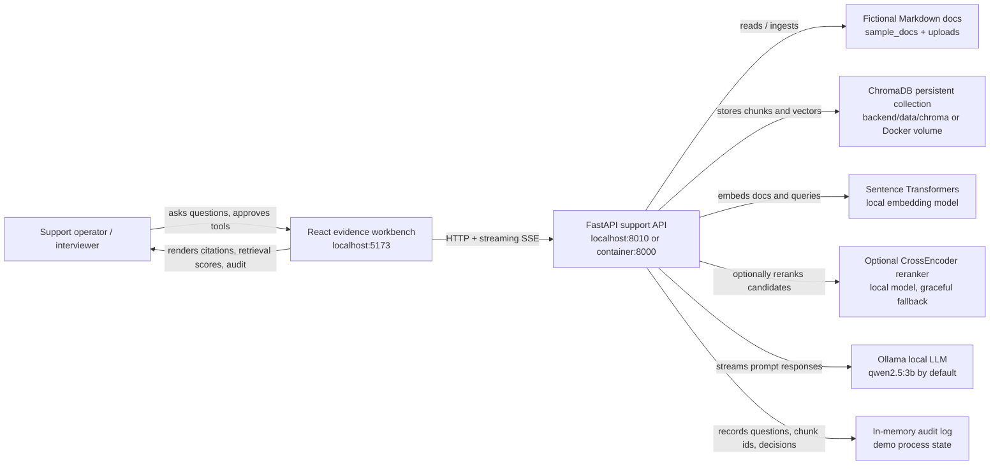
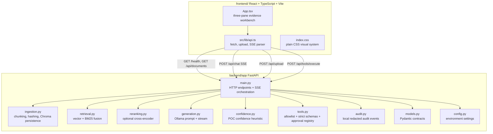
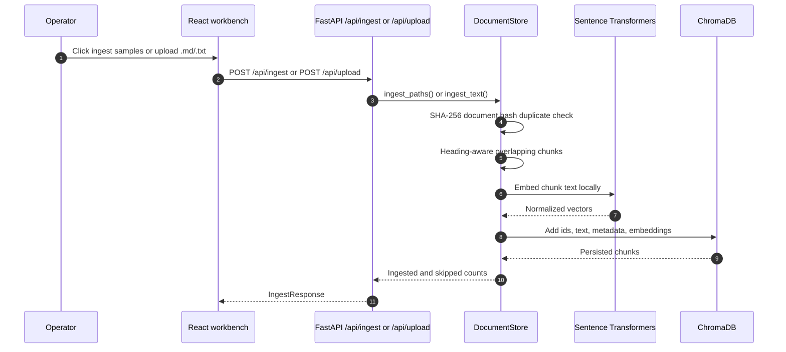
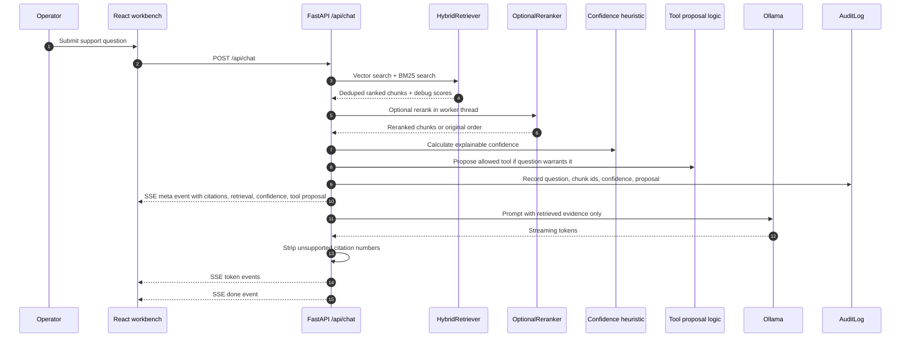
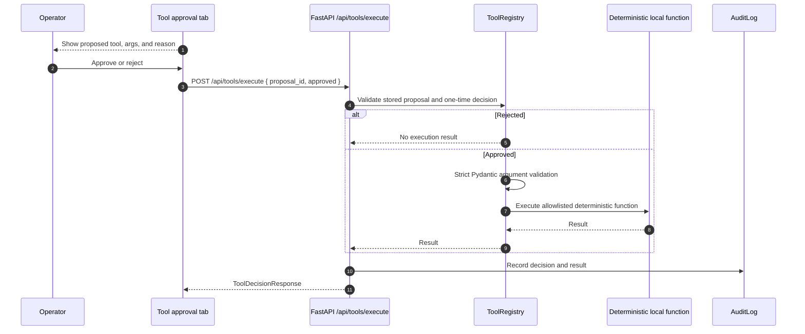

# Architecture

Grounded Support Assistant is a local proof-of-concept for evidence-first technical support. It is intentionally small: one FastAPI backend, one React workbench, local Chroma persistence, local embedding/reranking models, and Ollama for generation.

The architecture is optimized for interview clarity. Retrieval, citations, confidence, tool approval, and audit events are server-owned so the demo can explain where each grounded answer came from and why a risky action was not executed automatically.

## System Context

## Container Boundaries

## Data Ownership

| Data | Owner | Stored in | Notes |
| --- | --- | --- | --- |
| Source documents | `sample_docs/` and upload endpoint | Filesystem for samples; uploaded text is immediately chunked | Demo content is fictional and must stay free of real customer data. |
| Chunks and metadata | `DocumentStore` | Chroma collection `support_chunks` | Stores chunk text, filename, heading, chunk id, timestamp, and content hash. |
| Embeddings | `DocumentStore` | Chroma collection | Generated locally through Sentence Transformers. |
| BM25 corpus | `HybridRetriever` | Rebuilt in memory from stored chunks | Keeps exact technical terms, versions, headers, and error codes retrievable. |
| Citations | `main.py` | Response metadata only | Citation numbers are assigned from retrieved chunks and filtered during generation. |
| Tool proposals | `ToolRegistry` | In-memory process state | A proposal must exist before execution and can be decided only once. |
| Audit trail | `AuditLog` | In-memory process state | Redacted local demo log, not durable compliance storage. |

## Critical Flow: Ingestion

## Critical Flow: Grounded Chat

## Critical Flow: Tool Approval

## Module Contracts

| Module | Responsibility | Must not do |
| --- | --- | --- |
| `main.py` | Orchestrate endpoints, streaming, citation assignment, and audit writes | Embed business logic that belongs in retrieval/tools/confidence modules. |
| `ingestion.py` | Chunk documents, deduplicate by content hash, persist Chroma records | Call Ollama or decide answer confidence. |
| `retrieval.py` | Tokenize, run vector/BM25 retrieval, normalize and fuse scores | Generate answers or invent citations. |
| `reranking.py` | Optionally rerank candidates with a local model | Make reranking mandatory for a successful chat. |
| `generation.py` | Build grounded prompts and stream Ollama output | Execute tools or choose citation ids. |
| `confidence.py` | Produce a transparent heuristic label | Claim statistical calibration. |
| `tools.py` | Define the complete allowlist, strict schemas, proposal storage, and execution gate | Perform network, filesystem mutation, or production actions. |
| `audit.py` | Redact and record local demo audit events | Store secrets or act as compliance-grade durable logging. |

## Failure Modes

| Failure | Current behavior | Portfolio talking point | Production hardening |
| --- | --- | --- | --- |
| Ollama unavailable | `/health` reports degraded; chat streams an explicit unavailable message | The app fails closed instead of inventing support guidance | Queue/retry policy, model readiness probes, fallback model strategy. |
| Reranker unavailable | Hybrid retrieval continues and exposes `reranker_error` | Optional quality layer is not a single point of failure | Model cache management and versioned evaluation. |
| Empty or weak retrieval | Low confidence and escalation recommendation | The assistant admits insufficient evidence | Calibrated evaluation set and support-ticket routing integration. |
| Unknown/destructive tool | Rejected by allowlist or no proposal generated | The model never receives execution authority | Auth, RBAC, signed approvals, immutable audit store. |
| Duplicate document upload | Content hash skips duplicate ingestion | Deterministic ingestion behavior | Durable document registry and tenant-level versioning. |
| Process restart | Audit/proposals disappear | Honest POC boundary | Postgres/SQLite audit table and persisted proposal state. |

## Extension Points

- **Evaluation suite:** add a small question-answer gold set that checks citation precision, refusal behavior, and retrieval rank.
- **Durable audit:** move `AuditLog` and proposal decisions into SQLite or Postgres with migrations.
- **Authentication:** require operator identity before uploads or tool decisions.
- **Corpus management:** add delete/reindex/version operations for documents.
- **Provider abstraction:** keep local Ollama as default, but allow a guarded interface for another inference provider.
- **Reranking quality:** add model availability checks and surface model metadata in `/health`.

## What This Architecture Does Not Try To Solve

- Multi-tenant isolation
- Production support queue integration
- Real customer data ingestion
- Autonomous remediation
- Compliance-grade audit retention
- Calibrated confidence scoring

Those omissions are intentional for the proof-of-concept. The design keeps the important safety and retrieval decisions visible while avoiding infrastructure that would distract from the interview demonstration.
